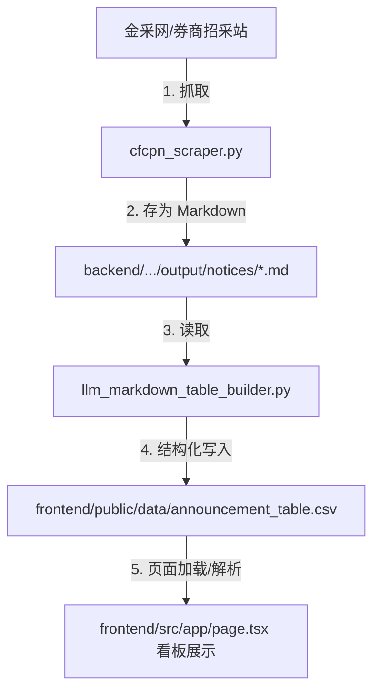

# 券商招采智能分析系统 - 前后端集成与联调指南 (intro.md)

本指南旨在向开发者介绍本系统的完整架构、数据流向，并提供详细的**前后端联调实现方案**，指导如何将前端“管理控制台”中的 **“一键更新爬虫”** 与 **“LLM 数据处理”** 占位逻辑接入真实的 Python 后端脚本。

---

## 一、 系统架构与项目布局

本系统是一个结合了 **Python 自动化数据流** 与 **Next.js 全栈 BI 看板** 的智能招采分析系统。

```
d:/broker-announcement-system-demo/
├── frontend/                     # 前端 Next.js 16 + shadcn/ui 全栈应用
│   ├── public/data/              # BI 看板数据源目录 (核心纽带)
│   │   ├── announcement_table.csv # LLM 结构化提取出的 CSV 汇总表
│   │   ├── announcement_table.jsonl
│   │   └── ai-analysis.json       # AI 定期生成的情报报告缓存
│   ├── src/
│   │   ├── app/
│   │   │   ├── page.tsx          # 前端主页面 (看板/图表/数据列表)
│   │   │   └── api/
│   │   │       └── ai-analysis/   # 已上线的 AI 深度情报分析接口 (调用大模型分析近 30 天招采数据)
│   │   └── components/
│   │       └── admin-dashboard.tsx # 管理控制台组件 (含“一键运行”触发逻辑)
│   └── package.json
│
├── backend/                      # 后端数据抓取与结构化清洗脚本
│   ├── config/
│   │   └── llm_api_config.json   # 共享的大模型 API 接口配置文件 (如模型名、API Key、Endpoint)
│   ├── python-http-www-cfcpn-com-jcw/
│   │   ├── cfcpn_scraper.py      # 金采网爬虫脚本 (产出 Markdown 原文公告)
│   │   └── output/notices/       # 爬虫输出目录 (保存爬取下来的 .md 文件)
│   └── llm_table/
│       └── llm_markdown_table_builder.py # LLM 招采结构化提取脚本 (处理 .md 生成结构化 CSV/JSONL/XLSX)
```

---

## 二、 核心数据流

前后端的数据闭环完全围绕 **CSV 文件** 与 **Markdown 公告** 展开，其流向如下：



### 1. 爬虫抓取阶段
- **执行脚本**：[cfcpn_scraper.py](file:///d:/broker-announcement-system-demo/backend/python-http-www-cfcpn-com-jcw/cfcpn_scraper.py)
- **核心逻辑**：基于断点续爬机制，增量抓取包含“证券”关键字的公告，将其转化为带有 Front Matter 元数据头的 Markdown 文件，并保存在 `backend/python-http-www-cfcpn-com-jcw/output/notices/` 下。

### 2. LLM 结构化阶段
- **执行脚本**：[llm_markdown_table_builder.py](file:///d:/broker-announcement-system-demo/backend/llm_table/llm_markdown_table_builder.py)
- **核心逻辑**：并发读取 notices 下的 `.md`，调用 `llm_api_config.json` 指定的大模型接口进行结构化处理。
- **输出至前端**：将提取出的数据规范化清洗后（包括把金额换算为元、期限换算为月/天，识别 `procurement_action` 采购主要动作），**直接输出/更新**至前端的 [frontend/public/data/announcement_table.csv](file:///d:/broker-announcement-system-demo/frontend/public/data/announcement_table.csv)。

### 3. 前端看板渲染阶段
- 当管理员或用户登录系统后，前端页面 [page.tsx](file:///d:/broker-announcement-system-demo/frontend/src/app/page.tsx) 自动通过 HTTP 请求加载 `public/data/announcement_table.csv`，由前端库 PapaParse 进行解析清洗，驱动 BI 仪表盘、漏斗、雷达图和表格的实时渲染。

---

## 三、 前后端联调实现方案 (API 接入指南)

为了在前端管理控制台 [admin-dashboard.tsx](file:///d:/broker-announcement-system-demo/frontend/src/components/admin-dashboard.tsx) 中真实运行爬虫和 LLM 处理程序，我们需要在 Next.js 服务端编写两个 API 路由，通过 Node.js 的 `child_process` 异步调用 Python 虚拟环境。

以下是联调所需的详细开发步骤和代码模板：

### 1. 编写“一键更新爬虫” API 路由

在前端目录新建 [frontend/src/app/api/run-scraper/route.ts](file:///d:/broker-announcement-system-demo/frontend/src/app/api/run-scraper/route.ts)：

```typescript
import { NextRequest, NextResponse } from "next/server";
import { spawn } from "child_process";
import { join } from "path";

const ADMIN_USER = process.env.ADMIN_USERNAME || "admin";
const ADMIN_PASS = process.env.ADMIN_PASSWORD || "admin2026";

export async function POST(request: NextRequest) {
  // 1. 校验管理员权限
  const authHeader = request.headers.get("authorization");
  if (!authHeader || !authHeader.startsWith("Basic ")) {
    return NextResponse.json({ error: "需要管理员认证" }, { status: 401 });
  }
  const base64Credentials = authHeader.split(" ")[1];
  const [username, password] = Buffer.from(base64Credentials, "base64").toString("utf-8").split(":");
  if (username !== ADMIN_USER || password !== ADMIN_PASS) {
    return NextResponse.json({ error: "权限不足" }, { status: 403 });
  }

  // 2. 配置 Python 路径与工作目录
  const projectRoot = join(process.cwd(), "..");
  const pythonExec = join(projectRoot, "backend", "python-http-www-cfcpn-com-jcw", ".venv", "Scripts", "python.exe");
  const scriptPath = join(projectRoot, "backend", "python-http-www-cfcpn-com-jcw", "cfcpn_scraper.py");

  // 默认命令参数 (与前几次优化保持一致)
  const args = [
    scriptPath,
    "--keyword", "证券",
    "--update",
    "--output-dir", "output",
    "--delay-min", "20",
    "--delay-max", "40",
    "--page-delay-min", "15",
    "--page-delay-max", "30",
    "--batch-size", "15",
    "--batch-rest-min", "100",
    "--batch-rest-max", "200",
    "--max-consecutive-403", "2",
    "--resume" // 支持从已有.md断点续爬
  ];

  // 3. 异步启动子进程
  console.log(`[Scraper] Starting: ${pythonExec} ${args.join(" ")}`);
  const child = spawn(pythonExec, args, {
    cwd: join(projectRoot, "backend", "python-http-www-cfcpn-com-jcw"),
    env: { ...process.env, PYTHONIOENCODING: "utf-8" },
  });

  // 使用 Server-Sent Events (SSE) 或分块传输流实时将日志返回给前端
  const responseStream = new TransformStream();
  const writer = responseStream.writable.getWriter();
  const encoder = new TextEncoder();

  child.stdout.on("data", (data) => {
    const text = data.toString();
    writer.write(encoder.encode(`data: ${JSON.stringify({ log: text })}\n\n`));
  });

  child.stderr.on("data", (data) => {
    const text = data.toString();
    writer.write(encoder.encode(`data: ${JSON.stringify({ error: text })}\n\n`));
  });

  child.on("close", (code) => {
    writer.write(encoder.encode(`data: ${JSON.stringify({ done: true, exitCode: code })}\n\n`));
    writer.close();
  });

  return new Response(responseStream.readable, {
    headers: {
      "Content-Type": "text/event-stream",
      "Cache-Control": "no-cache",
      "Connection": "keep-alive",
    },
  });
}
```

### 2. 编写“一键运行 LLM 提取” API 路由

在前端目录新建 [frontend/src/app/api/run-llm/route.ts](file:///d:/broker-announcement-system-demo/frontend/src/app/api/run-llm/route.ts)：

```typescript
import { NextRequest, NextResponse } from "next/server";
import { spawn } from "child_process";
import { join } from "path";

const ADMIN_USER = process.env.ADMIN_USERNAME || "admin";
const ADMIN_PASS = process.env.ADMIN_PASSWORD || "admin2026";

export async function POST(request: NextRequest) {
  // 1. 权限校验
  const authHeader = request.headers.get("authorization");
  if (!authHeader || !authHeader.startsWith("Basic ")) {
    return NextResponse.json({ error: "需要管理员认证" }, { status: 401 });
  }
  const base64Credentials = authHeader.split(" ")[1];
  const [username, password] = Buffer.from(base64Credentials, "base64").toString("utf-8").split(":");
  if (username !== ADMIN_USER || password !== ADMIN_PASS) {
    return NextResponse.json({ error: "权限不足" }, { status: 403 });
  }

  // 2. 配置路径 (LLM 提取后需直接写入前端 public/data/ 供看板读取)
  const projectRoot = join(process.cwd(), "..");
  const pythonExec = join(projectRoot, ".venv", "Scripts", "python.exe"); // 根目录的 venv 安装了 openai/pandas
  const scriptPath = join(projectRoot, "backend", "llm_table", "llm_markdown_table_builder.py");
  const inputDir = join(projectRoot, "backend", "python-http-www-cfcpn-com-jcw", "output", "notices");
  const outputDir = join(process.cwd(), "public", "data"); // 直接输出到前端公用数据文件夹
  const configPath = join(projectRoot, "backend", "config", "llm_api_config.json");

  const args = [
    scriptPath,
    "--input-dir", inputDir,
    "--output-dir", outputDir,
    "--llm-config", configPath,
    "--workers", "4",
    // "--full-refresh" // 根据需要选择是增量提取还是全量覆盖
  ];

  console.log(`[LLM Builder] Starting: ${pythonExec} ${args.join(" ")}`);
  const child = spawn(pythonExec, args, {
    cwd: join(projectRoot, "backend", "llm_table"),
    env: { ...process.env, PYTHONIOENCODING: "utf-8" },
  });

  const responseStream = new TransformStream();
  const writer = responseStream.writable.getWriter();
  const encoder = new TextEncoder();

  child.stdout.on("data", (data) => {
    writer.write(encoder.encode(`data: ${JSON.stringify({ log: data.toString() })}\n\n`));
  });

  child.stderr.on("data", (data) => {
    writer.write(encoder.encode(`data: ${JSON.stringify({ error: data.toString() })}\n\n`));
  });

  child.on("close", (code) => {
    writer.write(encoder.encode(`data: ${JSON.stringify({ done: true, exitCode: code })}\n\n`));
    writer.close();
  });

  return new Response(responseStream.readable, {
    headers: {
      "Content-Type": "text/event-stream",
      "Cache-Control": "no-cache",
      "Connection": "keep-alive",
    },
  });
}
```

### 3. 修改前端控制台 UI 组件进行联调

修改 [frontend/src/components/admin-dashboard.tsx](file:///d:/broker-announcement-system-demo/frontend/src/components/admin-dashboard.tsx) 里的异步请求方法以支持 SSE 实时日志解析展示：

```typescript
// ─── 修改 handleCrawler 方法 ───
const handleCrawler = useCallback(async () => {
  setCrawlerStatus("running");
  setCrawlerMsg("正在连接服务器并启动金采网爬虫...");
  
  try {
    const token = btoa(`${username}:admin2026`);
    const res = await fetch("/api/run-scraper", {
      method: "POST",
      headers: {
        Authorization: `Basic ${token}`,
      },
    });

    if (!res.ok) throw new Error("启动爬虫失败");

    const reader = res.body?.getReader();
    const decoder = new TextDecoder();

    if (reader) {
      while (true) {
        const { done, value } = await reader.read();
        if (done) break;
        const chunk = decoder.decode(value, { stream: true });
        const lines = chunk.split("\n");
        for (const line of lines) {
          if (line.startsWith("data: ")) {
            const data = JSON.parse(line.slice(6));
            if (data.log) {
              // 实时更新控制台打印的日志行数
              setCrawlerMsg((prev) => prev + "\n" + data.log.trim());
            }
            if (data.done) {
              setCrawlerStatus("done");
              setCrawlerMsg((prev) => prev + `\n\n爬虫进程执行完毕 (ExitCode: ${data.exitCode})`);
            }
          }
        }
      }
    }
  } catch (err) {
    setCrawlerStatus("error");
    setCrawlerMsg("爬虫执行出错，请检查后端网络连接或查看服务器日志");
  }
}, [username]);

// ─── 修改 handleProcess 方法 ───
const handleProcess = useCallback(async () => {
  setProcessStatus("running");
  setProcessMsg("开始读取增量 Markdown 公告并调用 LLM 进行表格化解析...");

  try {
    const token = btoa(`${username}:admin2026`);
    const res = await fetch("/api/run-llm", {
      method: "POST",
      headers: {
        Authorization: `Basic ${token}`,
      },
    });

    if (!res.ok) throw new Error("启动结构化处理器失败");

    const reader = res.body?.getReader();
    const decoder = new TextDecoder();

    if (reader) {
      while (true) {
        const { done, value } = await reader.read();
        if (done) break;
        const chunk = decoder.decode(value, { stream: true });
        const lines = chunk.split("\n");
        for (const line of lines) {
          if (line.startsWith("data: ")) {
            const data = JSON.parse(line.slice(6));
            if (data.log) {
              setProcessMsg((prev) => prev + "\n" + data.log.trim());
            }
            if (data.done) {
              setProcessStatus("done");
              setProcessMsg((prev) => prev + `\n\nLLM 数据提取并同步更新至看板 CSV 文件成功！`);
            }
          }
        }
      }
    }
  } catch (err) {
    setProcessStatus("error");
    setProcessMsg("结构化处理执行失败，请检查 llm_api_config.json 以及 API 点数配置");
  }
}, [username]);
```

---

## 四、 本地开发与调试指令

在开始前后端调试之前，请确保依赖正确安装并且配置符合要求。

### 1. 前端服务启动
在 `frontend/` 目录运行以下命令安装 Node 包并启动 NextJS 开发服务器：
```bash
# 1. 安装前端 npm 依赖
pnpm install

# 2. 启动开发服务器 (默认端口 5000)
coze dev
# 或者用：pnpm dev
```

### 2. 后端环境检查
- 爬虫依赖位于子目录 [python-http-www-cfcpn-com-jcw/.venv](file:///d:/broker-announcement-system-demo/backend/python-http-www-cfcpn-com-jcw/.venv) 内。
- LLM 表格处理器依赖（包含 `openai`, `pandas`, `openpyxl` 等）位于项目根目录下的全局虚拟环境 [.venv](file:///d:/broker-announcement-system-demo/.venv) 中。

在手动测试后端时，可执行以下命令：
```powershell
# 手动运行爬虫 (断点续爬模式)
d:\broker-announcement-system-demo\backend\python-http-www-cfcpn-com-jcw\.venv\Scripts\python.exe backend\python-http-www-cfcpn-com-jcw\cfcpn_scraper.py --keyword "证券" --resume

# 手动运行 LLM 结构化提取 (直接向前端数据目录输出 CSV 结果)
d:\broker-announcement-system-demo\.venv\Scripts\python.exe backend\llm_table\llm_markdown_table_builder.py --input-dir backend\python-http-www-cfcpn-com-jcw\output\notices --output-dir frontend\public\data --llm-config backend\config\llm_api_config.json --workers 4
```
